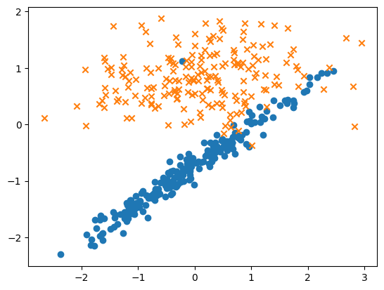
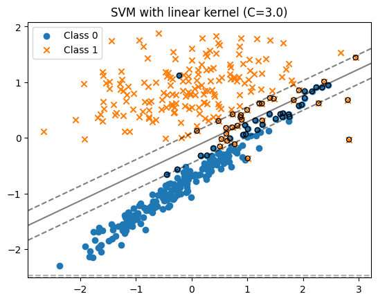
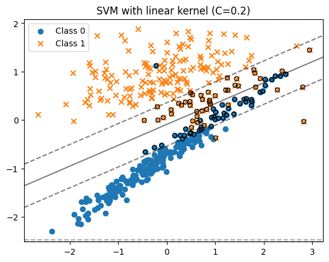
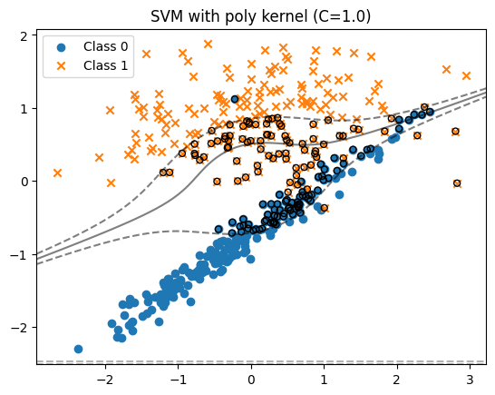
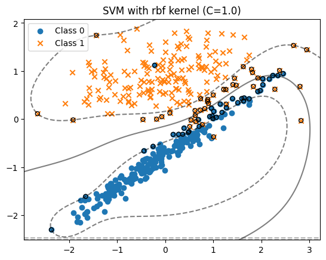
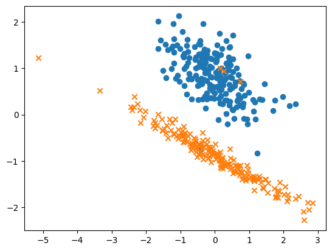
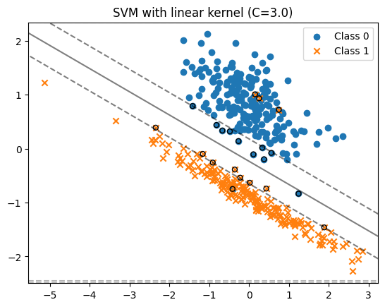
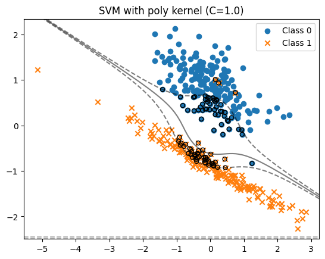
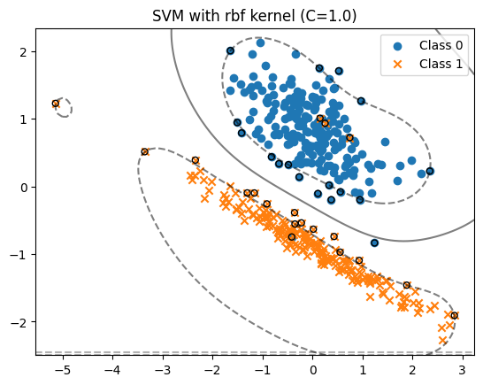

# SVM Classification with Visualization

This repository contains Python code for generating synthetic datasets, training Support Vector Machine (SVM) classifiers, and visualizing the decision boundaries and support vectors.
## kernels
### `Radial Basis Function (RBF) Kernel`
### `Polynomial Kernel`
### `Linear Kernel`
## Code Overview

### `generate_and_plot_data` Function

This function generates synthetic datasets for binary classification tasks and plots the training points. It takes the following parameters:

- `n_samples`: Number of samples in the dataset.
- `n_informative`: Number of informative features.
- `n_redundant`: Number of redundant features.
- `class_sep`: Separation between classes.
- `random_state`: Seed for reproducibility.

### `train_and_plot_svm2` Function

This function trains an SVM classifier with a linear kernel and plots the decision boundary, support vectors, and margin lines. It includes options to visualize multiple SVMs with different parameters.

- `X_train`, `y_train`: Training data and labels.
- `kernel`: SVM kernel type (e.g., 'linear', 'poly', 'rbf').
- `C`: Regularization parameter.

### `train_and_plot_svm` Function

Similar to `train_and_plot_svm2`, this function includes additional features for better visualization. It uses a colorful colormap for the decision function contour plot and visualizes support vectors in red.

### Example Usage

```python
np.random.seed(42)
for i in range(3):
    X_train, y_train = generate_and_plot_data(n_samples=500, n_informative=2, n_redundant=0, class_sep=1.5, random_state=i)
    train_and_plot_svm2(X_train, y_train, kernel='linear', C=3.0)
    train_and_plot_svm2(X_train, y_train, kernel='linear', C=0.2)
    train_and_plot_svm2(X_train, y_train, kernel='poly', C=1.0)
    train_and_plot_svm2(X_train, y_train, kernel='rbf', C=1.0)
```
# SVM Parameters
- `kernel`: Type of kernel function used in the SVM ('linear', 'poly', 'rbf').
- `C`: Regularization parameter. A higher value of C emphasizes correct classification of training data, potentially leading to a more complex decision boundary.
 ## first output
 
 
 
 
 

## second output
 
 
 
 
 