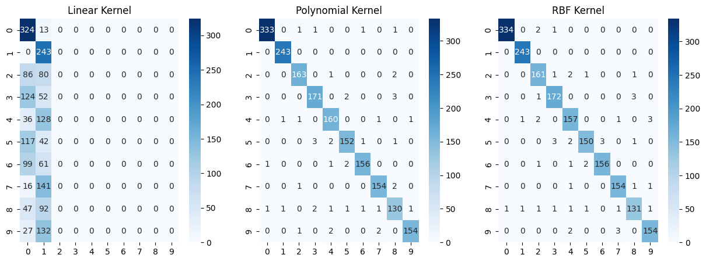

# SVM Kernel Comparison on USPS Dataset

This Markdown document explains the Python code that compares the performance of Support Vector Machines (SVMs) with different kernels (linear, polynomial, and RBF) on the USPS dataset. The code includes loading the dataset, training SVM models, and visualizing the results.

## Code Overview

### Loading and Preprocessing the Dataset

The code uses the USPS dataset, which is loaded and preprocessed. The dataset consists of handwritten digits, and the features are normalized to values between 0 and 1.

```python
# Load USPS dataset
usps = datasets.fetch_openml(name="usps", version=2)

# Preprocess and split the dataset
X = usps.data.astype("float32") / 255.0
y = usps.target.astype("int")

X_train, X_test, y_train, y_test = train_test_split(X, y, test_size=0.2, random_state=42)
```
# lower accuracy with linear kernel 
` Non-Linearity in Data`
- The linear kernel assumes that the underlying relationship in the data is linear. If the true relationship is non-linear, as is often the case in complex datasets like images or handwritten digits, the linear kernel may fail to capture the intricate patterns, resulting in lower accuracy.

`Complex Decision Boundaries`

- Handwritten digits, such as those in the USPS dataset, may have intricate and non-linear patterns that cannot be effectively separated by a straight line. The linear kernel is limited in its ability to model complex decision boundaries, leading to suboptimal performance.

`Feature Space Transformation`
- The linear kernel implicitly works in the original feature space. For datasets with non-linear relationships, transforming the data into a higher-dimensional feature space (as done by non-linear kernels like polynomial or RBF) might be necessary to find better decision boundaries.

# high accuracy with poly kernel 

`Capturing Non-Linear Patterns`
- The polynomial kernel introduces non-linearity by considering polynomial combinations of features. This flexibility allows the SVM model to capture more complex relationships in the data, making it suitable for datasets with non-linear patterns.

`Higher-Dimensional Feature Space`
- The polynomial kernel implicitly maps the input features into a higher-dimensional space. This transformation allows the SVM to find more intricate decision boundaries that can separate non-linearly separable classes in the original feature space.

`Versatility in Degree Selection`
- The degree parameter in the polynomial kernel allows for different levels of polynomial complexity. By adjusting the degree, the model can adapt to the specific degree of non-linearity present in the data. This flexibility is crucial for achieving a good balance between bias and variance.

`Ability to Learn Non-Linear Features`
- By introducing polynomial features, the SVM with a polynomial kernel gains the ability to learn non-linear features and relationships between the input features. This is particularly beneficial when dealing with intricate patterns in image or handwritten digit datasets.

# Compare outputs
 
- `Accuracy (Linear Kernel):` 0.30483870967741933
- `Accuracy (Polynomial Kernel):` 0.9763440860215054
- `Accuracy (RBF Kernel):` 0.9741935483870968